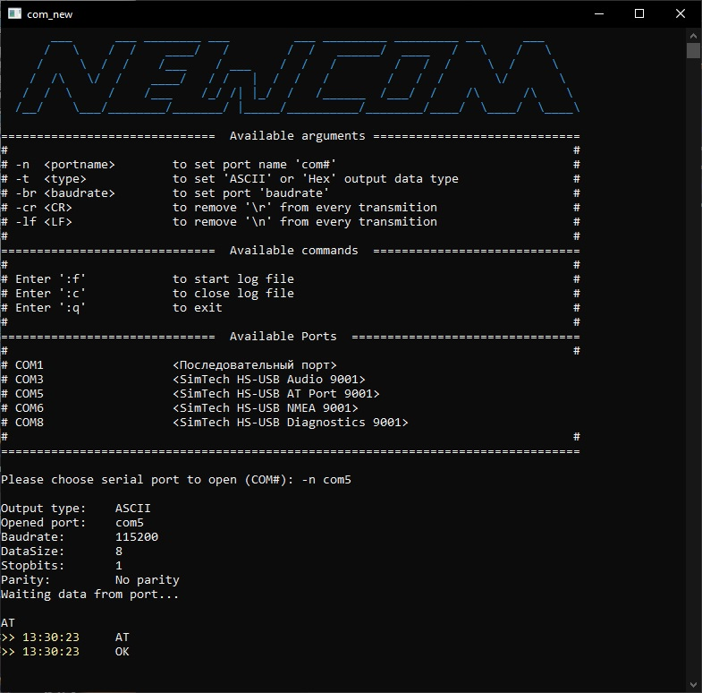

# NEWCOM
### Simple COM-port Terminal (Windows)

This application is based on Win-API and provides Serial communication with different devices connected to system COM ports. NewCom is console application.

Main features are:  

* Read \ Write operations with time-stamping
* Log file support 
* List of connected devices
* CR \ LF control

